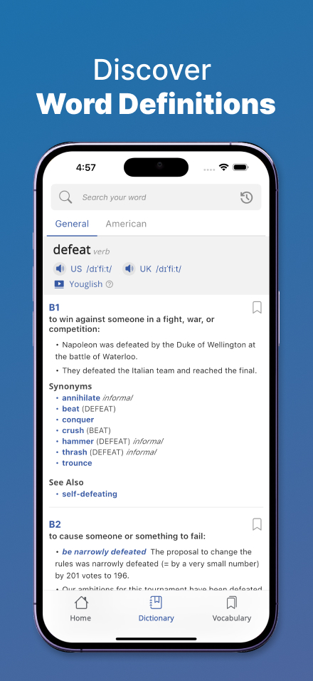
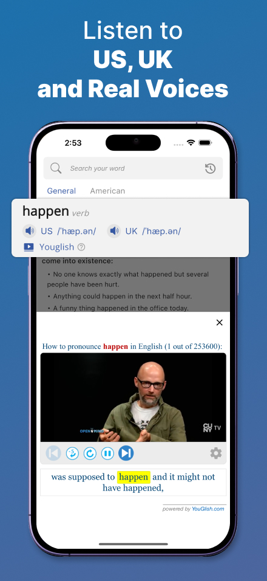
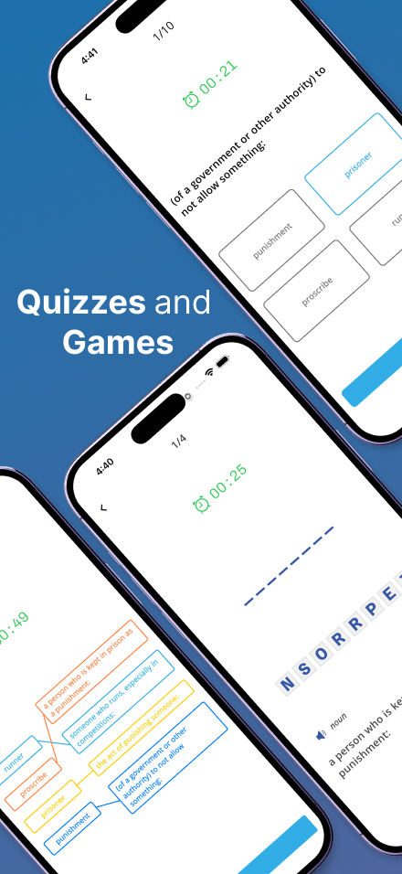
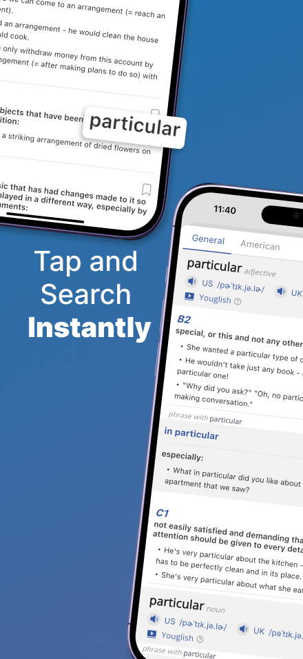
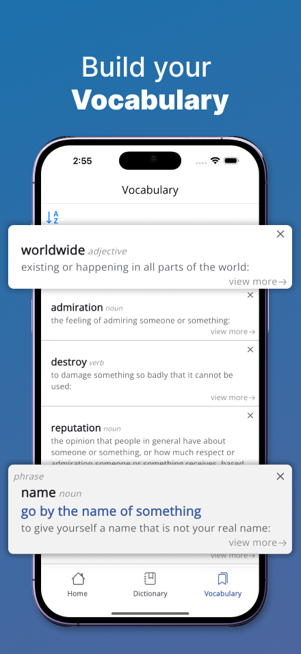
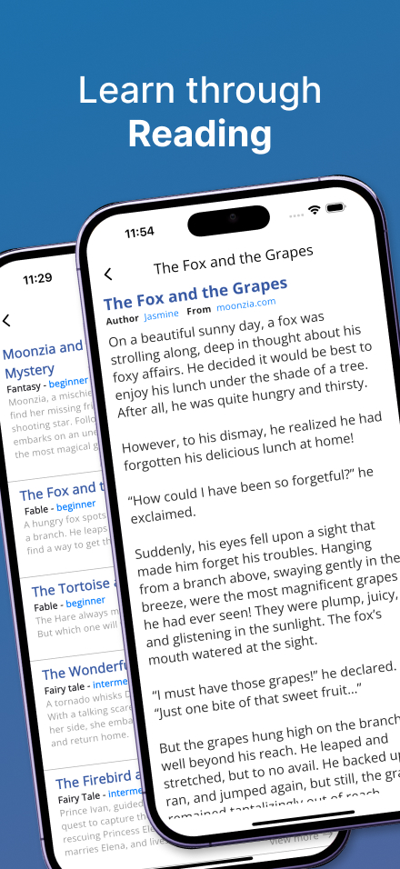

# EngDict Documentation

## 1. Overview
EngDict is a mobile application designed to help English learners search for words they are curious about. The app provides definitions classified by different fields and allows users to practice their saved words, making learning easier and more engaging.






## 2. Features
- **Word Search**: Users can search for English words, and definitions are provided in English.
- **Pronunciation Support**: Users can listen to word pronunciations in **US**, **UK**, and real-world **video contexts**.
- **Save Words**: Users can save words for future reference and practice.
- **Word Practice**: The app provides interactive features to help users review and practice saved words.
- **Tap-to-Lookup**: Users can tap on unknown words within the app for quick lookup.
- **Reading Mode**: Users can read stories to enhance their reading skills and vocabulary.

## 3. Technical Details
### **Technology Stack**
- **Frontend**: Flutter
- **Backend**: Java Spring Boot + SQLite
- **API**: Web Scraping + YouGlish API
- **Architecture**: Model-View-Controller (MVC)
- **Networking**: RESTful API

## 4. Installation & Setup
### **Prerequisites**
- Install **Flutter** (Version: **3.27.2**)
- Install **Android Studio** or **VS Code** with Flutter plugin
- Set up **Java Development Kit (JDK)** for backend development
- Install **SQLite** for database management

### **Installation Steps**
#### **Frontend Setup**
1. Clone the repository:
   ```sh
   git clone https://github.com/nguyenhuuthai-99/eng_dict
   cd engdict-app
   ```
2. Install dependencies:
   ```sh
   flutter pub get
   ```
3. Run the app:
   ```sh
   flutter run
   ```


## 5. API Usage
- **Web Scraping**: Retrieves word definitions from dictionary sources.
- **YouGlish API**: Provides real-world video context for word pronunciation.

## 6. Future Enhancements
- AI-powered word recommendations
- Speech-to-text support for voice search
- Gamified learning modules for vocabulary retention

